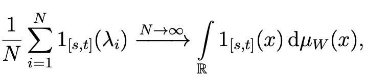

---
layout:
  title:
    visible: true
  description:
    visible: true
  tableOfContents:
    visible: true
  outline:
    visible: true
  pagination:
    visible: false
---

# Page

<figure><figcaption></figcaption></figure>

这意味着计算多少特征值在这个区间，收敛关于极限分布的积分

$$\frac{1}{N}\sum^N_i f(\lambda_ i) \rightarrow \int f(x)d u_w(x)$$

Instead of 1, we take f(x) = x^n

$$\frac{1}{N}\sum^N_i (\lambda_ i)^n \rightarrow \int x^n d u_w(x)$$

## what is the advantage  of f(x) = x^n better

$$A = A^*$$ , A is diagonised , $$A = UDU^*$$

$$A^n = U D^n U^* , D =\begin{pmatrix}   &\lambda^n_1   &0 \\     &0  &\lambda^n_i \end{pmatrix}$$ means , $$\sum \lambda^n_i = Tr(D^n) = Tr(A^n)$$

and thus&#x20;

$$\frac{1}{N}\sum^N_i (\lambda_ i)^n  = \frac{1}{N} Tr(A^n)$$

这里需标准化也就是除以N，要不当矩阵维度很大的时候，会爆炸

## Notation

$$t_r= \frac{1}{N} T_r$$

<figure><figcaption></figcaption></figure>

我们就可以计算trace，而不是特征值了。

## choice of scaling

我们需要选择正确的缩放比。

For the case $$a_{i,j} \in (-1, +1)$$, $$A = A^*$$,  we have

<figure><figcaption></figcaption></figure>

最后等于N是因为，a是1 或者-1。

<figure><figcaption></figcaption></figure>

因为要不N -> 1, 所以除以 sqrt(N),&#x20;

<figure><figcaption></figcaption></figure>

左边是随机的，我们产生许多矩阵，右边是，大多数都表现出相同的特征分布 for N large

## 1.12 Def (note 1.8)

(1) def 1.5 the standard semicircular distribution $$\mu _w$$, w for wigner

$$du_w = \frac{1}{2\pi} \sqrt{4-x^2} dx$$

(2) Catalan numbers

$$C_k = \frac{1}{k+1} \begin{pmatrix} 2k \\ k \end{pmatrix}$$

Theorem 1.6

(i) 递归特性，知道c\_0 就决定了C\_k

(ii) 唯一确定性 &#x20;

1.14 Types of convergence （Note 1.9)

矩阵幂的trace收敛到catalan number，因为矩阵可以看成随机对象。我们有很多矩阵，并非所有矩阵都趋向catalan number，他们总是非典型的，有完全不同行为。  我们说的是many of them are very close to the Catalan number。

$$tr(A^{2k}_N) \rightarrow C_k$$

(\*) 可以理解为： I have a discrete space of matrices. Each matrix has the same probability. So this just means the matrices here. counting just the matrices for which this is the case. I'm dividing by the number of all matrices.

我们用平均数来证明。凭直觉我们用平均来接近这个，然后我们使用密度。

这种现象表明大多数矩阵都接近平均值

随机性，目前为止都没有真正的随机性，在用概率语言来说，这些矩阵有这种行为。

（1） 平均收敛

（2） 偏离&#x20;

在高纬度中，事情通常非常接近其平均值

convergence traces in the matrices converge to moments of the limiting object 关于收敛measeures

Note that

$$\frac{1}{N}\sum^N_i f(\lambda_ i) \rightarrow \int f(x)d u_w(x)$$

函数适用于 $$\lambda_i,$$ i从1 到n，n无穷大，

我们·看到右边有measure，半圆。而左边没有直接的measure，我们要写成一个measure，从衡量标准来看。

This is actually a statement on convergence of measures。this is the measure which puts mass one over n on each of the eigenvalues of my matrix. this is called eigenvalue distribution of matrix

每个特征值的质量设为1/n 的度量。same information encode as  a measure. 实际数量是积分

$$\frac{1}{N}\sum^N_i f(\lambda_ i) = \int f(x)d u_A(x)$$

for  $$u_A(x) = \frac{1}{N}(\delta_{\lambda_i} +...+\delta_{\lambda_n})$$狄拉克车测量, eigenvalue distribution of A&#x20;

Hence this convergence&#x20;

$$\int f(x)d u_{A_n} \rightarrow  \int f(x)d u_{w}$$ ( $$N \rightarrow \infty$$)

If we require this for sufficiently many f this is kind of convergence that measures $$\mu_{A_N} \rightarrow \mu_w$$

We will need to understand such convergence of measures better and we'll later develop tools (Cauchy transform or _Stieltjes_ transform)  to deal with them

随机矩阵的矩收敛到semi-circle。typical behavior and behavior average

